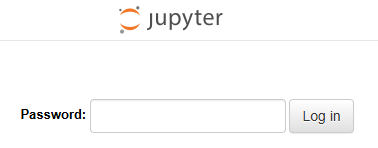
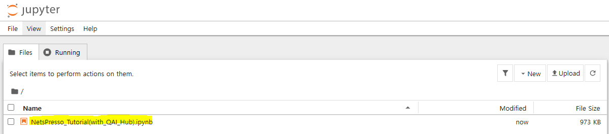
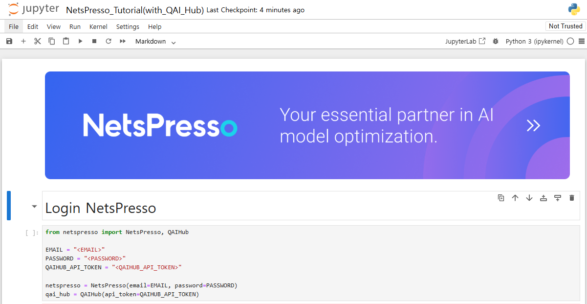

# How to run jupyter notebook

This guide explains how to set up and run Jupyter notebooks in a Docker environment for NetsPresso.

## Prerequisites

- Docker installed on your system
- NVIDIA GPU drivers (for GPU support)
- NVIDIA Container Toolkit (for GPU support)

## Detailed Steps

## 1. Docker build

```bash
docker build --tag netspresso:latest -f notebooks/dockerfiles/Dockerfile-py3.8.16 .
```

This command builds a Docker image with all required dependencies.

## 2. Docker run

```bash
docker run --gpus all -it --ipc=host -p 50001:8888 \
--name netspresso-latest \
netspresso:latest \
bash
```

Options explained:
- `--gpus all`: Enable GPU support
- `-it`: Interactive terminal
- `--ipc=host`: Shared memory settings
- `-p 50001:8888`: Port mapping (host:container)
- `--name netspresso-latest`: Container name

- If you don't have a GPU, remove the gpus option.

## 3. Set jupyter notebook password(in Docker)

```bash
jupyter notebook password
```

This creates a secure password for accessing your Jupyter notebook.

## 4. Run jupyter notebook(in Docker)

```bash
jupyter notebook --ip 0.0.0.0 --allow-root
```

This starts the Jupyter notebook server inside the container.

## 5. Enter jupyter server address

Enter ip and port into your web browser.


Default address will be: `http://localhost:50001`

## 6. Enter password

Enter the jupyter password that you entered during the password setup process.



## 7. Move the provided notebook file to jupyter server



You can upload your notebook files using the Jupyter interface.

## 8. Run notebook file



## Troubleshooting

1. **Port already in use**
   - Change the port mapping in the docker run command (e.g., `-p 50002:8888`)

2. **GPU not detected**
   - Verify NVIDIA drivers are installed
   - Check NVIDIA Container Toolkit installation
   - Run `nvidia-smi` to verify GPU is recognized

3. **Memory issues**
   - Increase Docker memory limit in Docker Desktop settings
   - Close unnecessary applications

## Additional Resources

- [Docker Documentation](https://docs.docker.com/)
- [Jupyter Notebook Documentation](https://jupyter-notebook.readthedocs.io/)
- [NVIDIA Container Toolkit Documentation](https://docs.nvidia.com/datacenter/cloud-native/container-toolkit/overview.html)